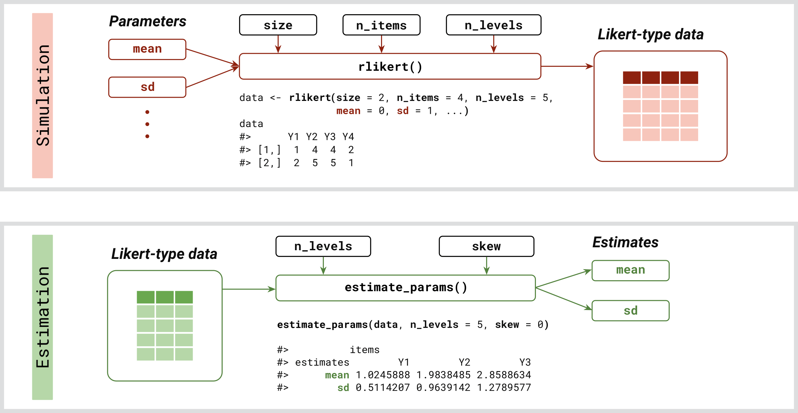
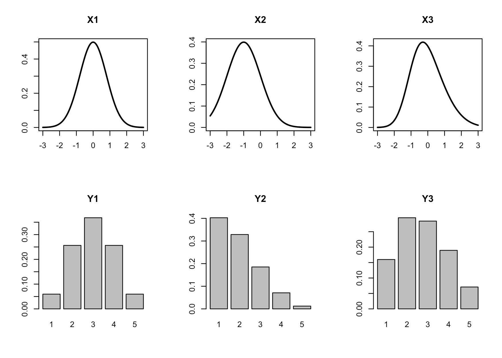

<!-- README.md is generated from README.Rmd. Please edit that file -->

```{r setup, include = FALSE}
knitr::opts_chunk$set(
  collapse = TRUE,
  comment = "#>",
  fig.path = "man/figures/README-",
  dpi=250,
  out.width = "70%")
```

# latent2likert <a href="https://lalovic.io/latent2likert/"></a>

<!-- badges: start -->
[](https://github.com/markolalovic/latent2likert/actions/workflows/R-CMD-check.yaml)
[](https://app.codecov.io/gh/markolalovic/latent2likert?branch=main)
<!-- badges: end -->


## Overview

The R package **latent2likert** is designed to effectively simulate the discretization process inherent to Likert scales while minimizing distortion. It converts continuous latent variables into ordinal categories to generate Likert scale item responses. This is particularly useful for accurately modeling and analyzing survey data that use Likert scales, especially when applying statistical techniques that require metric data.


## Installation

You can install the development version from GitHub with:
```{r, eval = FALSE}
# install.packages("devtools")
#devtools::install_github("markolalovic/latent2likert")
```

```{r, include = FALSE}
devtools::load_all("/Users/markolalovic/dev/latent2likert/")
```


## Dependencies

To keep the package lightweight, **latent2likert** only imports [mvtnorm](https://cran.r-project.org/package=mvtnorm), along with the standard R packages stats and graphics, which are typically included in R releases. An additional suggested dependency is the [sn package](https://cran.r-project.org/package=sn), which is required only for generating random responses from correlated Likert items based on a multivariate skew normal distribution. The package prompts the user to install this dependency during interactive sessions if needed.


## Features

* `rlikert`: Generates random responses to Likert scale questions based on specified means and standard deviations of latent variables, with optional settings for skewness and correlations.
* `estimate_params`: Estimates latent parameters from existing survey data.


## Structure

<figure>
    
    <figcaption><em>Overview of inputs and outputs.</em></figcaption>
</figure>


## Using `rlikert`

To generate a sample of random responses to one item on a 5-point Likert scale, use:

```{r}
#library(latent2likert)
rlikert(size = 10, n_items = 1, n_levels = 5)
```

To generate responses to multiple items with specified parameters:

```{r}
rlikert(size = 10,
        n_items = 3,
        n_levels = c(4, 5, 6),
        mean = c(0, -1, 0), 
        sd   = c(0.8, 1, 1),
        corr = 0.5)
```                
You can also provide a correlation matrix:

```{r}
corr <- matrix(c(1.00, -0.63, -0.39, 
                 -0.63, 1.00, 0.41, 
                 -0.39, 0.41, 1.00), nrow=3)
data <- rlikert(size = 10^3,
                n_items = 3,
                n_levels = c(4, 5, 6),
                mean = c(0, -1, 0), 
                sd   = c(0.8, 1, 1),
                corr = corr)
```
Note that the correlations among the Likert response variables are only estimates of the actual correlations between the latent variables, and these estimates are typically lower:

```{r}
cor(data)
```


## Using `estimate_params`

Given the data, you can estimate the values of latent parameters using:

```{r}
estimate_params(data, n_levels = c(4, 5, 6), skew = 0)
```


## Transformation

To visualize the transformation, you can use `plot_likert_transform()`. It plots the densities of latent variables in the first row and transformed discrete probability distributions below:

```{r, eval = FALSE}
plot_likert_transform(n_items = 3,
                      n_levels = 5,
                      mean = c(0,  -1, 0), 
                      sd   = c(0.8, 1, 1), 
                      skew = c(0,   0, 0.5))
```

<figure>
    
    <figcaption><em>Transformation of latent variables to Likert response variables.</em></figcaption>
</figure>
<br>


Note that, depending on the value of the skewness parameter, the normal latent distribution is used if skew = 0, otherwise the skew normal distribution is used. The value of skewness is restricted to the range -0.95 to 0.95, that is

>  `skew >= -0.95` and `skew <= 0.95`.


## Further Reading

* For more detailed information and practical examples, please refer to the package [vignette](https://lalovic.io/latent2likert/articles/intro_to_latent2likert.html).
* The implemented algorithms are described in the functions [reference](https://lalovic.io/latent2likert/reference/index.html).

## Related R Packages

To simulate Likert item responses, the `draw_likert` function from the [fabricatr](https://CRAN.R-project.org/package=fabricatr) package can be used to recode a latent variable into a Likert response variable by specifying intervals that subdivide the continuous range. The **latent2likert** package, however, offers an advantage by automatically calculating optimal intervals that minimize distortion between the latent variable and the Likert response variable for both normal and skew normal latent distributions, eliminating the need to manually specify the intervals.

There are also several alternative approaches that do not rely on latent distributions. One method involves directly defining a discrete probability distribution and sampling from it using the sample function in R or the `likert` function from the [wakefield](https://CRAN.R-project.org/package=wakefield) package. Another approach is to specify the means, standard deviations, and correlations among Likert response variables. For this, you can use [LikertMakeR](https://CRAN.R-project.org/package=LikertMakeR) or [SimCorMultRes](https://CRAN.R-project.org/package=SimCorMultRes) to generate correlated multinomial responses.

Additionally, you can define a data generating process. For those familiar with item response theory, the [mirt](https://CRAN.R-project.org/package=mirt) package allows users to specify discrimination and difficulty parameters for each response category.
