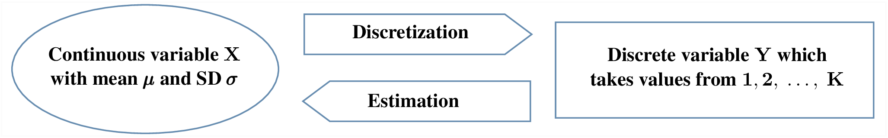
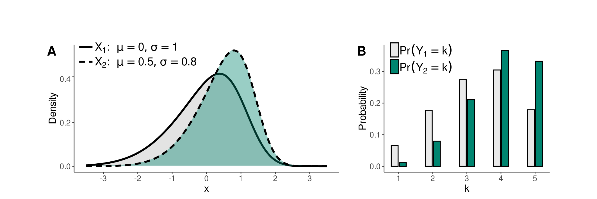

```{r setup, include=FALSE}
knitr::opts_chunk$set(
  collapse = TRUE,
  comment = "#>",
  fig.path = "./figures/README_",
  dpi=450)
```

## responsesR: simulate Likert item responses in R 

<!-- badges: start -->
[](https://opensource.org/licenses/MIT)
[](https://github.com/markolalovic/responsesR/actions/workflows/R-CMD-check.yaml)
<!-- badges: end -->

This package aims to provide an easy way to:

- Simulate Likert-scale data in R, enabling users to define distributions, means, standard deviations, and correlations among latent variables.
- Generate Likert-type responses for single or multiple items.
- Simulate Likert scales with associations between items to measure underlying constructs.
- Create artificial data to validate theoretical findings, when employing statistical techniques such as Factor Analysis and Structural Equation Modeling.
- Estimate means and standard deviations of latent variables to recreate existing rating-scale data.

## Installation
You can install the latest version using `devtools`:
```{r eval=FALSE}
# install.packages("devtools")
library(devtools)
install_github("markolalovic/responsesR")
```

## Examples
Below you'll find two simple examples that illustrate how to create synthetic datasets with responsesR.

```{r}
library(responsesR)
```

### Simulating survey data
The following sample code creates a simulated survey data. The hypothetical survey simulation is roughly based on the actual [comparative study](https://arxiv.org/abs/2201.12960) on teaching and learning R in a pair of introductory statistics labs.

Consider a scenario where 10 participants who completed Course A and 20 participants who completed Course B have taken the survey. Let's assume the initial question was:

> "How would you rate your experience with the course?" 

with four possible answers: 

> Poor, Fair, Good, and Excellent. 

Let's suppose that participants in Course A had a neutral opinion regarding the question, while those in Course B, on average, had a more positive experience.

By choosing appropriate parameters for the latent distributions and setting number of categories `K = 4`, we can generate hypothetical responses (standard deviation `sd = 1` and skewness `gamma1 = 0`, by default):
```{r}
set.seed(12345) # to ensure reproducible results
course_A <- get_responses(n = 10, mu = 0, K = 4)
course_B <- get_responses(n = 20, mu = 1, K = 4)
```

Below are the responses to the question, visualized using a grouped bar chart:
<details>
  <summary><b><a style="cursor: pointer;">Click here to expand </a></b> </summary>

``` r
# To summarize the results, create a data frame from all responses.
K <- 4
ngroups <- 2
cats <- c("Poor", "Fair", "Good", "Excellent")
data <- data.frame(
  Course = rep(c("A", "B"), each=K),
  Response = factor(rep(cats, ngroups), levels=cats),
  Prop = c(get_prop_table(course_A, K), get_prop_table(course_B, K)))
data <- data[data$Prop > 0, ]
# > data
#   Course  Response Prop
# 1      A      Poor 0.30
# 2      A      Fair 0.20
# 3      A      Good 0.20
# 4      A Excellent 0.30
# 6      B      Fair 0.10
# 7      B      Good 0.25
# 8      B Excellent 0.65

# The results can then be visualized using a grouped bar chart.
xbreaks <- seq(from = 0, to = .8, length.out = 5)
xlimits <- c(0, max(data$Prop) + 0.01)
xlabs <- sapply(xbreaks, percentify)
data$Course <- factor(data$Course, levels = c("B", "A"))
p <- ggplot(data=data, aes(x=Prop, y=Response, fill=Course)) +
  geom_col(position=position_dodge2(preserve = "single", padding = 0)) +  
  scale_x_continuous(breaks = xbreaks, labels = xlabs, limits = xlimits) +  
  scale_y_discrete(limits = rev(levels(data$Response))) +
  scale_fill_manual("legend", 
                    values = c("#64BAAA", "#154E56"), 
                    labels = c("Course A", "Course B"),
                    limits = c("A", "B")) + 
  ggtitle("How would you rate your experience with the course?") +
  theme(text = element_text(size=10),
        axis.title.y = element_blank(),
        axis.title.x = element_blank(),
        legend.position = "bottom",
        legend.title = element_blank(),
        plot.title = element_text(size=11))
p
```

</details>
<p> </p>

```{r courses_grouped_bar_chart, fig.align = 'center', out.width = "80%", echo = FALSE}
knitr::include_graphics("./figures/articles_courses_grouped_bar_chart-1.png")
```

Suppose that the survey also asked the participants to rate their skills on a 5-point Likert scale, ranging from 1 (very poor) to 5 (very good) in:

* Programming, 
* Searching Online, 
* Solving Problems. 

The survey was completed by the participants both before and after taking the course for a pre and post-comparison. Suppose that participants' assessments of:

* Programming skills on average increased, 
* Searching Online stayed about the same,
* Solving Problems increased in Course A, but decreased for participants in Course B.

Let's simulate the survey data for this scenario (number of categories is `K = 5` by default):
```{r}
set.seed(12345) # to ensure reproducible results

# Pre- and post assessments of skills: 1, 2, 3 for course A
pre_A <- get_responses(n = 10, mu = c(-1, 0, 1))
post_A <- get_responses(n = 10, mu = c(0, 0, 2))

# Pre- and post assessments of skills: 1, 2, 3 for course B
pre_B <- get_responses(n = 20, mu = c(-1, 0, 1))
post_B <- get_responses(n = 20, mu = c(0, 0, 0)) # <-- decrease for skill 3
```

The grouped bar chart below displays the responses to Likert-scale questions before and after the survey:
<details>
  <summary><b><a style="cursor: pointer;">Click here to expand </a></b> </summary>

``` r
# To summarize the results, create a data frame from all responses.
data <- list(pre_A, post_A, pre_B, post_B)
items <- 6 # for 3 questions before and after
K <- 5 # for a 5-point Likert scale
skills <- c("Programming", "Searching online", "Solving problems")
questions <- rep(as.vector(sapply(skills, function(skill) rep(skill, K))), 4)
questions <- factor(questions, levels = skills)
data <- data.frame (
  Course = c(rep("Course A", items * K), rep("Course B", items * K)),
  Question = questions,
  Time = as.factor(rep(c(rep("before", 3*K), rep("after", 3*K)), 2)),
  resp = rep(rep(1:K, 3), length(data)),
  prop = as.vector(sapply(data, function(d) as.vector(t(get_prop_table(d, K))))))
# > head(data)
#     Course         Question   Time resp prop
# 1 Course A      Programming before    1  0.2
# 2 Course A      Programming before    2  0.4
# 3 Course A      Programming before    3  0.3
# 4 Course A      Programming before    4  0.0
# 5 Course A      Programming before    5  0.1
# 6 Course A Searching online before    1  0.1

# And visualize the results with a stacked bar chart:
data_pos <- data[data$resp >= 4, ]
data_neg <- data[data$resp <= 2, ]

data_neu <- data[data$resp == 3, ]
data_neu$prop <- data_neu$prop / 2

data_pos <- rbind(data_pos, data_neu)
data_pos$resp <- factor(data_pos$resp, levels = rev(1:5))

data_neg <- rbind(data_neg, data_neu)
data_neg$prop <- (-data_neg$prop)
data_neg$resp <- factor(data_neg$resp, levels = 1:5)

color_palette <- brewer.pal(n=5, name = "BrBG") 
color_palette[3] <- "#bababaff"
p <- ggplot(data = data_pos, aes(x = Time, y = prop, fill = resp)) +
  geom_col() +
  geom_col(data = data_neg) +
  coord_flip() +
  facet_nested(
    rows = vars(Question, Course), switch = "y",
    strip = strip_nested(size = "variable"),
    labeller = labeller(Question = label_wrap_gen(width = 10))
  ) +
  theme_bw() +
  theme(strip.placement = "outside") +
  theme(
    axis.ticks.x = element_blank(),
    axis.ticks.y = element_blank(),
    legend.position = "bottom",
    legend.title = element_blank(),
    text = element_text(size = 10),
    strip.text.y.left = element_text(angle = 0, size = 8),
    panel.spacing.y = unit(c(2, 5, 2, 5, 2), "mm")
  ) +
  xlab("") +
  ylab("Percentage") +
  scale_y_continuous(limits = c(-1, 1), 
                     breaks = seq(from = -1, to = 1, by = 0.5), 
                     labels = c(100, 50, 0, 50, 100)) + 
  scale_fill_manual("", breaks = 1:5, values = color_palette,
                      labels = c("Very poor", "Poor", "Fair", "Good", "Very good"))
p
```

</details>
<p> </p>
```{r courses_stacked_bar_chart, fig.align = 'center', out.width = "80%", echo = FALSE}
knitr::include_graphics("./figures/articles_courses_stacked_bar_chart-1.png")
```

### Replicating survey data
The following sample code covers the topic of replicating survey data in order to create scale scores. For this, we will use part of [bfi dataset](https://search.r-project.org/CRAN/refmans/psych/html/bfi.html) from package psych. In particular, only the first 5 items A1-A5 corresponding to agreeableness and attribute gender:

```{r}
library(psych)
avars <- c("A1", "A2", "A3", "A4", "A5")
data <- bfi[, c(avars, "gender")]
```

Each item was answered on a six point scale ranging from 1 (very inaccurate), to 6 (very accurate) and the size of the female and male samples were 1881 and 919 respectively:
<details>
  <summary><b><a style="cursor: pointer;">Click here to expand </a></b> </summary>

``` r
# Males = 1, Females = 2.
mapdf <- data.frame(old = 1:2, new = c("Male", "Female"))
data$gender <- mapdf$new[match(data$gender, mapdf$old)]

# Impute the missing values.
for (avar in avars) {
  data[, avar][is.na(data[, avar])] <- median(data[, avar], na.rm=TRUE)
}
knitr::kable(head(data), format="html")
table(data$gender)
```

</details>
<p> </p>
```{r, echo=FALSE}
# Males = 1, Females = 2.
mapdf <- data.frame(old = 1:2, new = c("Male", "Female"))
data$gender <- mapdf$new[match(data$gender, mapdf$old)]

# Impute the missing values.
for (avar in avars) {
  data[, avar][is.na(data[, avar])] <- median(data[, avar], na.rm=TRUE)
}
knitr::kable(head(data), format="html")
table(data$gender)
```

Separate the items into two groups according to their gender.
```{r}
items_M <- data[data$gender == "Male", avars]
items_F <- data[data$gender == "Female", avars]
```

To reproduce the items, start by estimating the parameters of the latent variables, assuming they are normal (`gamma1 = 0` by default) and providing the number of possible response categories `K = 6`:
```{r}
params_M <- estimate_parameters(data = items_M, K = 6)
params_F <- estimate_parameters(data = items_F, K = 6)
params_M
params_F
```

Then, generate new responses to the items using the estimated parameters and correlations:
```{r}
set.seed(12345) # to ensure reproducible results

new_items_M <- get_responses(n = nrow(items_M), 
                             mu = params_M["mu", ], 
                             sd = params_M["sd", ],
                             K = 6,
                             R = cor(items_M))

new_items_F <- get_responses(n = nrow(items_F), 
                             mu = params_F["mu", ],
                             sd = params_F["sd", ],
                             K = 6,
                             R = cor(items_F))
```

To compare the results, we can plot the correlations matrix with bar charts on the diagonal:
```{r agree_items_correlations_comparison, fig.align = 'center', out.width = "80%", echo = FALSE}
knitr::include_graphics("./figures/articles_agree_items_correlations_comparison-1.png")
```

The next step would be to create agreeableness scale scores for both groups of participants, by taking the average of these 5 items and visualize the results with a grouped boxplot:
<details>
  <summary><b><a style="cursor: pointer;">Click here to expand </a></b> </summary>

``` r
# Combine new items and gender in new_data data frame.
new_data <- data.frame(rbind(new_items_M, new_items_F))
new_data$gender <- c(rep("Male", nrow(items_M)), rep("Female", nrow(items_F)))
head(new_data)

# We also need to reverse the first item because it has negative correlations
data$A1 <- (min(data$A1) + max(data$A1)) - data$A1
new_data$Y1 <- (min(new_data$Y1) + max(new_data$Y1)) - new_data$Y1

# Create agreeableness scale scores
data$agreeable <- rowMeans(data[, avars])
new_data$agreeable <- rowMeans(new_data[, c("Y1", "Y2", "Y3", "Y4", "Y5")])

# And visualize the results with a grouped boxplot.
scale_boxplot <- function(data, title="") {
  xbreaks <- seq(from = 2, to = 6, length.out = 3)
  p <- ggplot(data, aes(x = agreeable, y = gender)) + 
    geom_boxplot() +
    scale_x_continuous(breaks = xbreaks) +
    ggtitle(title) +
    theme(text = element_text(size = 8),
          plot.title = element_text(size=10),          
          axis.title.y = element_blank())
  return(p)
}
p1 <- scale_boxplot(data, "Agreeableness in men and women")
p2 <- scale_boxplot(new_data, "Reproduced agreeableness in men and women")
plot_grid(p1, p2,  nrow = 2)
```

</details>
<p> </p>

```{r agreeableness_grouped_boxplot, fig.align = 'center', out.width = "60%", echo = FALSE}
knitr::include_graphics("./figures/articles_agreeableness_grouped_boxplot-1.png")
```

## Dependency statement
To maintain a lightweight package, responsesR only imports [mvtnorm](https://cran.r-project.org/web/packages/mvtnorm/index.html), along with the standard R packages stats and graphics, which are typically included in R releases. An additional suggested dependency is the package [sn](https://cran.r-project.org/web/packages/sn/index.html), necessary only for generating random responses from correlated Likert items with multivariate skew normal latent distribution. However, the package prompts the user to install this dependency during interactive sessions.

## Simulation design
Simulating Likert item responses begins by selecting a continuous distribution, which is then transformed into a discrete probability distribution using a method called discretization. This process is illustrated in Figure 2.

```{r simulation_process_r, fig.align = 'center', out.width = "70%", fig.cap = "Figure 2: Flow diagram of the simulation process.", echo = FALSE}

```

The transformation is visually depicted in Figures 3 and 4. These figures show the densities of normally distributed X1 and X2 in Figure 3A and skew normally distributed X1 and X2 with skewness `gamma1 = -0.6` in Figure 4A. Corresponding discrete probability distributions of Y1 and Y2 with `K = 5` categories are presented in Figures 3B and 4B. 

```{r mapping_normal_r, fig.align = 'center', out.width = "80%", fig.cap = "Figure 3: Relationship between normally distributed X and responses Y.", echo = FALSE}
knitr::include_graphics("./figures/mapping_normal.png")
```

```{r mapping_skew_r, fig.align = 'center', out.width = "80%", fig.cap = "Figure 4: Relationship between skew normal X with gamma1 = -0.6, and responses Y.", echo = FALSE}

```


