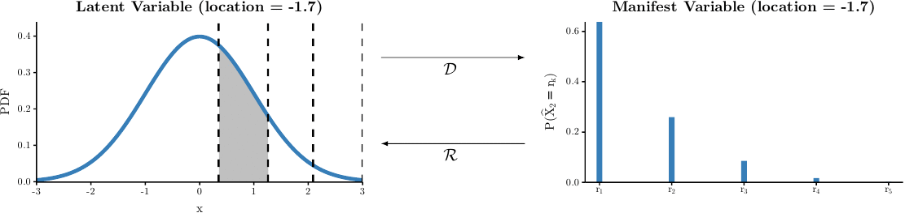
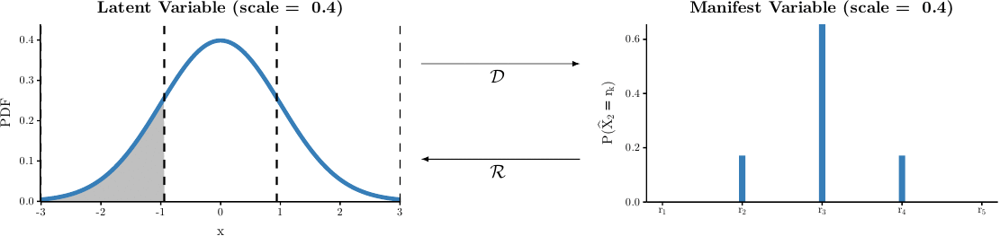
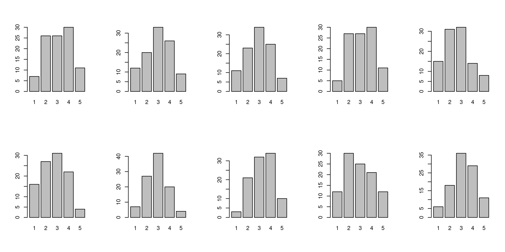
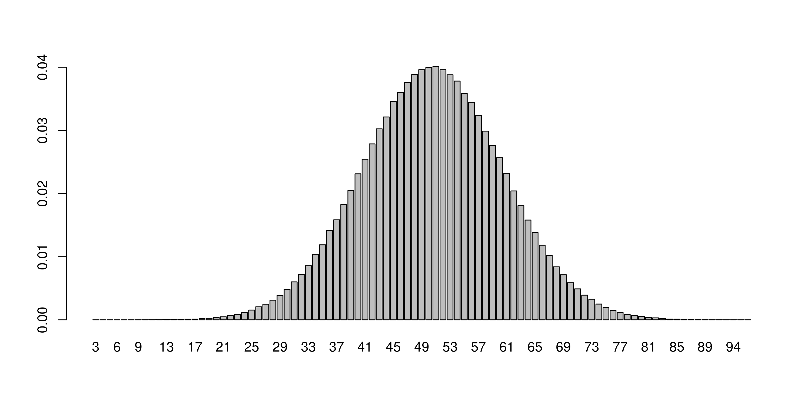
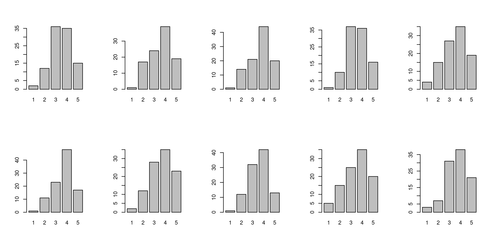
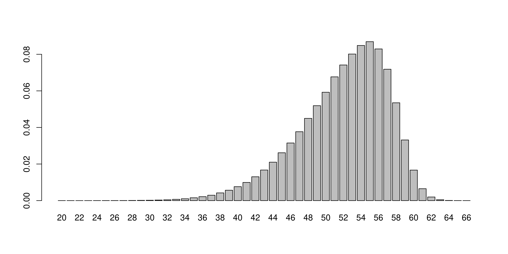

# responsesR
This repository contains an R package called *responsesR* for simulation of Likert-scale data in R. Using optimal discretization and skew-normal distribution we can simulate symmetrically or asymmetrically distributed Likert scale item responses while maintaining the relationship between variables with nice mathematical properties.

&nbsp;






&nbsp;

# How to simulate Likert-scale data in R

To generate a sample of simulated Likert scale item responses in R we can use a simple function called `rLikert` from responsesR package.

To install the package from GitHub, we first need `devtools`:

```R
install.packages("devtools")
library(devtools)
```

Then, we can install it by using:

```R
install_github("markolalovic/responsesR")
library(responsesR)
```

## Simulate unbiased responses

To generate a sample of size = 100 with the number of Likert scale items = 10:

```R
responses <- rLikert(size = 100, items = 10)
```

The result is a data frame of simulated responses where rows correspond to observations and columns to Likert scale items:

```R
head(responses)
```


<table>
<caption>A data.frame: 6 × 10</caption>
<thead>
	<tr><th></th><th scope=col>X1</th><th scope=col>X2</th><th scope=col>X3</th><th scope=col>X4</th><th scope=col>X5</th><th scope=col>X6</th><th scope=col>X7</th><th scope=col>X8</th><th scope=col>X9</th><th scope=col>X10</th></tr>
	<tr><th></th><th scope=col>&lt;int&gt;</th><th scope=col>&lt;int&gt;</th><th scope=col>&lt;int&gt;</th><th scope=col>&lt;int&gt;</th><th scope=col>&lt;int&gt;</th><th scope=col>&lt;int&gt;</th><th scope=col>&lt;int&gt;</th><th scope=col>&lt;int&gt;</th><th scope=col>&lt;int&gt;</th><th scope=col>&lt;int&gt;</th></tr>
</thead>
<tbody>
	<tr><th scope=row>1</th><td>2</td><td>4</td><td>2</td><td>4</td><td>1</td><td>2</td><td>4</td><td>4</td><td>3</td><td>2</td></tr>
	<tr><th scope=row>2</th><td>4</td><td>3</td><td>3</td><td>2</td><td>4</td><td>1</td><td>2</td><td>3</td><td>2</td><td>3</td></tr>
	<tr><th scope=row>3</th><td>3</td><td>2</td><td>3</td><td>2</td><td>1</td><td>5</td><td>3</td><td>4</td><td>5</td><td>2</td></tr>
	<tr><th scope=row>4</th><td>2</td><td>4</td><td>3</td><td>2</td><td>3</td><td>4</td><td>2</td><td>2</td><td>5</td><td>1</td></tr>
	<tr><th scope=row>5</th><td>5</td><td>3</td><td>1</td><td>2</td><td>4</td><td>3</td><td>3</td><td>3</td><td>1</td><td>3</td></tr>
	<tr><th scope=row>6</th><td>2</td><td>4</td><td>2</td><td>2</td><td>2</td><td>4</td><td>2</td><td>2</td><td>3</td><td>4</td></tr>
</tbody>
</table>


```R
par(mfrow=c(2, 5))
for(i in 1:10) {
    barplot(table(responses[, i]))
}
```





By default, the function `rLikert` generates symmetrically distributed responses from a standard normal distribution. Also by default, it is using the 5-point Likert scale. We can set the number of possible responses by setting the "levels" parameter; e.g. for a 10-point Likert scale by setting `levels = 10`.

By increasing the sample size (and a number of levels), the sampling distribution converges to a normal distribution. We can observe this by increasing the sample size to a million and levels to 100 (the number of items = 1 by default):


```R
responses <- rLikert(size = 10^6, levels = 100)
barplot(table(responses)/10^6)
```




## Simulate response bias

To simulate asymmetrically distributed responses we can:

* Shift the distribution by using the `location` parameter.
* Change the variability or spread by using the `scale` parameter.
* Introduce asymmetry or skewness by using the `shape` parameter.

More specifically, to simulate some properties of our hypothetical survey respondents, we can try to achieve for example that they:

* More strongly agree with some statement: by increasing the `location` parameter.
* Survey respondents provide common or typical answers: by decreasing the `scale` parameter.
* Survey respondents prefer the right side: by decreasing the `shape` parameter.


```R
responses <- rLikert(size=100, items=10,
                     location=0.3, scale=0.8, shape=-5)
```


```R
par(mfrow=c(2, 5))
for(i in 1:10) {
    barplot(table(responses[, i]))
}
```




By increasing the sample size (and a number of levels), the sampling distribution converges to a skew-normal distribution. We can observe this by increasing the sample size to a million and levels to 100 (the number of items = 1 by default):


```R
responses <- rLikert(size = 10^6, levels = 100,
                     location=0.3, scale=0.8, shape=-5)
barplot(table(responses)/10^6)
```





