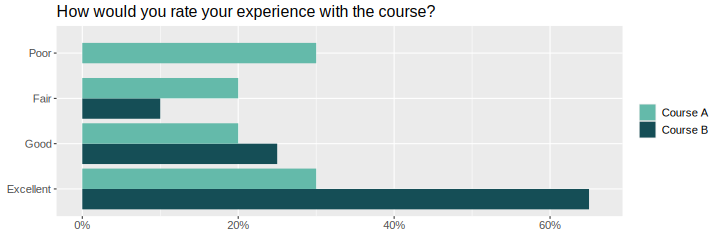
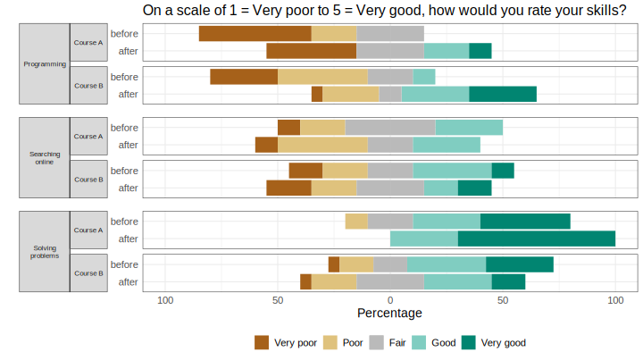

## responsesR: simulate Likert item responses in R 

<!-- badges: start -->

[](https://opensource.org/licenses/MIT)
[](https://codecov.io/gh/markolalovic/responsesR)
[](https://github.com/markolalovic/responsesR/actions/workflows/R-CMD-check.yaml)
[](https://doi.org/10.5281/zenodo.10889981)
<!-- badges: end -->

This package provides an easy framework to simulate survey data commonly
analyzed in applied social research, specifically Likert items. Users
can specify latent variables by providing means, standard deviations,
and optionally, skewness and correlations. The generated data set
represents responses to Likert scale questions, which can be used for
various purposes, such as validating theoretical findings obtained
through factor analysis and structural equation modeling. The package
also allows for the estimation of parameters from existing survey data
to replicate it more accurately.

## Installation

You can install the latest version using devtools:

``` r
install.packages("devtools")
devtools::install_github("markolalovic/responsesR")
```

## Code examples

Below are two simple examples. For more details, refer to the articles
on the [package website](https://lalovic.io/responsesR/).

### Simulating survey data

Here’s how to generate a simulated survey data. Consider a scenario
where 10 participants who completed Course A and 20 participants who
completed Course B have answered the question:

> “How would you rate your experience with the course?”

Suppose that on average participants in Course A had a neutral
experience, while those in Course B had a more positive experience. By
choosing appropriate parameters for the latent variables and setting the
number of categories (to K = 4 in this example), we can generate
hypothetical responses (standard deviation sd = 1 and skewness gamma1 =
0, by default):

``` r
library(responsesR) # load the package
set.seed(12345) # to ensure reproducible results

course_A <- get_responses(n = 10, mu = 0, K = 4)
course_B <- get_responses(n = 20, mu = 1, K = 4)
```

Below are the generated responses visualized using a grouped bar chart:
<details>
<summary>
<b><a style="cursor: pointer;">Click here to expand </a></b>
</summary>

``` r
# To summarize the results, create a data frame from all responses.
K <- 4
ngroups <- 2
cats <- c("Poor", "Fair", "Good", "Excellent")
data <- data.frame(
  Course = rep(c("A", "B"), each=K),
  Response = factor(rep(cats, ngroups), levels=cats),
  Prop = c(get_prop_table(course_A, K), get_prop_table(course_B, K)))
data <- data[data$Prop > 0, ]
# > data
#   Course  Response Prop
# 1      A      Poor 0.30
# 2      A      Fair 0.20
# 3      A      Good 0.20
# 4      A Excellent 0.30
# 6      B      Fair 0.10
# 7      B      Good 0.25
# 8      B Excellent 0.65

# The results can then be visualized using a grouped bar chart.
xbreaks <- seq(from = 0, to = .8, length.out = 5)
xlimits <- c(0, max(data$Prop) + 0.01)
xlabs <- sapply(xbreaks, percentify)
data$Course <- factor(data$Course, levels = c("B", "A"))
p <- ggplot(data=data, aes(x=Prop, y=Response, fill=Course)) +
  geom_col(position=position_dodge2(preserve = "single", padding = 0)) +  
  scale_x_continuous(breaks = xbreaks, labels = xlabs, limits = xlimits) +  
  scale_y_discrete(limits = rev(levels(data$Response))) +
  scale_fill_manual("legend", 
                    values = c("#64BAAA", "#154E56"), 
                    labels = c("Course A", "Course B"),
                    limits = c("A", "B")) + 
  ggtitle("How would you rate your experience with the course?") +
  theme(text = element_text(size=10),
        axis.title.y = element_blank(),
        axis.title.x = element_blank(),
        legend.position = "bottom",
        legend.title = element_blank(),
        plot.title = element_text(size=11))
p
```

</details>
<p>
</p>



For a pre- and post comparison, suppose that the participants completed
the survey both before and after taking the course. And suppose that
participants’ assessments of their skills in:

1.  Programming on average increased,
2.  Searching online stayed about the same,
3.  Solving problems increased in Course A, but decreased for
    participants in Course B.

Let’s simulate the survey data for this scenario using a 5-point Likert
scale (K = 5, by default):

``` r
# Pre- and post assessments of skills: 1, 2, 3 for course A
pre_A <- get_responses(n = 10, mu = c(-1, 0, 1))
post_A <- get_responses(n = 10, mu = c(0, 0, 2))

# Pre- and post assessments of skills: 1, 2, 3 for course B
pre_B <- get_responses(n = 20, mu = c(-1, 0, 1))
post_B <- get_responses(n = 20, mu = c(0, 0, 0)) # <-- decrease for skill 3
```

Below is the grouped bar chart of the generated responses:
<details>
<summary>
<b><a style="cursor: pointer;">Click here to expand </a></b>
</summary>

``` r
# To summarize the results, create a data frame from all responses.
data <- list(pre_A, post_A, pre_B, post_B)
items <- 6 # for 3 questions before and after
K <- 5 # for a 5-point Likert scale
skills <- c("Programming", "Searching online", "Solving problems")
questions <- rep(as.vector(sapply(skills, function(skill) rep(skill, K))), 4)
questions <- factor(questions, levels = skills)
data <- data.frame (
  Course = c(rep("Course A", items * K), rep("Course B", items * K)),
  Question = questions,
  Time = as.factor(rep(c(rep("before", 3*K), rep("after", 3*K)), 2)),
  resp = rep(rep(1:K, 3), length(data)),
  prop = as.vector(sapply(data, function(d) as.vector(t(get_prop_table(d, K))))))
# > head(data)
#     Course         Question   Time resp prop
# 1 Course A      Programming before    1  0.2
# 2 Course A      Programming before    2  0.4
# 3 Course A      Programming before    3  0.3
# 4 Course A      Programming before    4  0.0
# 5 Course A      Programming before    5  0.1
# 6 Course A Searching online before    1  0.1

# And visualize the results with a stacked bar chart:
data_pos <- data[data$resp >= 4, ]
data_neg <- data[data$resp <= 2, ]

data_neu <- data[data$resp == 3, ]
data_neu$prop <- data_neu$prop / 2

data_pos <- rbind(data_pos, data_neu)
data_pos$resp <- factor(data_pos$resp, levels = rev(1:5))

data_neg <- rbind(data_neg, data_neu)
data_neg$prop <- (-data_neg$prop)
data_neg$resp <- factor(data_neg$resp, levels = 1:5)

color_palette <- brewer.pal(n=5, name = "BrBG") 
color_palette[3] <- "#bababaff"
p <- ggplot(data = data_pos, aes(x = Time, y = prop, fill = resp)) +
  geom_col() +
  geom_col(data = data_neg) +
  coord_flip() +
  facet_nested(
    rows = vars(Question, Course), switch = "y",
    strip = strip_nested(size = "variable"),
    labeller = labeller(Question = label_wrap_gen(width = 10))
  ) +
  theme_bw() +
  theme(strip.placement = "outside") +
  theme(
    axis.ticks.x = element_blank(),
    axis.ticks.y = element_blank(),
    legend.position = "bottom",
    legend.title = element_blank(),
    text = element_text(size = 10),
    strip.text.y.left = element_text(angle = 0, size = 8),
    panel.spacing.y = unit(c(2, 5, 2, 5, 2), "mm")
  ) +
  xlab("") +
  ylab("Percentage") +
  scale_y_continuous(limits = c(-1, 1), 
                     breaks = seq(from = -1, to = 1, by = 0.5), 
                     labels = c(100, 50, 0, 50, 100)) + 
  scale_fill_manual("", breaks = 1:5, values = color_palette,
                      labels = c("Very poor", "Poor", "Fair", "Good", "Very good"))
p
```

</details>
<p>
</p>



### Replicating survey data

The following sample code covers the topic of replicating survey data in
order to create scale scores. For this, we will use part of [bfi
dataset](https://search.r-project.org/CRAN/refmans/psych/html/bfi.html)
from package psych. In particular, the first 5 items A1-A5 corresponding
to agreeableness and attribute gender:

``` r
library(psych)
vars <- c("A1", "A2", "A3", "A4", "A5")
data <- bfi[, c(vars, "gender")]
```

Each item was answered on a six point scale ranging from 1 (very
inaccurate), to 6 (very accurate) and the size of the female and male
samples were 1881 and 919 respectively:
<details>
<summary>
<b><a style="cursor: pointer;">Click here to expand </a></b>
</summary>

``` r
# Males = 1, Females = 2.
mapdf <- data.frame(old = 1:2, new = c("Male", "Female"))
data$gender <- mapdf$new[match(data$gender, mapdf$old)]

# Impute the missing values.
for (var in vars) {
  data[, var][is.na(data[, var])] <- median(data[, var], na.rm=TRUE)
}
knitr::kable(head(data), format="html")
table(data$gender)
```

</details>
<p>
</p>
<table>
<thead>
<tr>
<th style="text-align:left;">
</th>
<th style="text-align:right;">
A1
</th>
<th style="text-align:right;">
A2
</th>
<th style="text-align:right;">
A3
</th>
<th style="text-align:right;">
A4
</th>
<th style="text-align:right;">
A5
</th>
<th style="text-align:left;">
gender
</th>
</tr>
</thead>
<tbody>
<tr>
<td style="text-align:left;">
61617
</td>
<td style="text-align:right;">
2
</td>
<td style="text-align:right;">
4
</td>
<td style="text-align:right;">
3
</td>
<td style="text-align:right;">
4
</td>
<td style="text-align:right;">
4
</td>
<td style="text-align:left;">
Male
</td>
</tr>
<tr>
<td style="text-align:left;">
61618
</td>
<td style="text-align:right;">
2
</td>
<td style="text-align:right;">
4
</td>
<td style="text-align:right;">
5
</td>
<td style="text-align:right;">
2
</td>
<td style="text-align:right;">
5
</td>
<td style="text-align:left;">
Female
</td>
</tr>
<tr>
<td style="text-align:left;">
61620
</td>
<td style="text-align:right;">
5
</td>
<td style="text-align:right;">
4
</td>
<td style="text-align:right;">
5
</td>
<td style="text-align:right;">
4
</td>
<td style="text-align:right;">
4
</td>
<td style="text-align:left;">
Female
</td>
</tr>
<tr>
<td style="text-align:left;">
61621
</td>
<td style="text-align:right;">
4
</td>
<td style="text-align:right;">
4
</td>
<td style="text-align:right;">
6
</td>
<td style="text-align:right;">
5
</td>
<td style="text-align:right;">
5
</td>
<td style="text-align:left;">
Female
</td>
</tr>
<tr>
<td style="text-align:left;">
61622
</td>
<td style="text-align:right;">
2
</td>
<td style="text-align:right;">
3
</td>
<td style="text-align:right;">
3
</td>
<td style="text-align:right;">
4
</td>
<td style="text-align:right;">
5
</td>
<td style="text-align:left;">
Male
</td>
</tr>
<tr>
<td style="text-align:left;">
61623
</td>
<td style="text-align:right;">
6
</td>
<td style="text-align:right;">
6
</td>
<td style="text-align:right;">
5
</td>
<td style="text-align:right;">
6
</td>
<td style="text-align:right;">
5
</td>
<td style="text-align:left;">
Female
</td>
</tr>
</tbody>
</table>

    #> 
    #> Female   Male 
    #>   1881    919

Separate the items into two groups according to their gender.

``` r
items_M <- data[data$gender == "Male", vars]
items_F <- data[data$gender == "Female", vars]
```

To reproduce the items, start by estimating the parameters of the latent
variables, assuming they are normal (`gamma1 = 0` by default) and
providing the number of possible response categories `K = 6`:

``` r
params_M <- estimate_parameters(data = items_M, K = 6)
params_F <- estimate_parameters(data = items_F, K = 6)
params_M
#>          items
#> estimates         A1         A2         A3         A4         A5
#>        mu -0.6618876  0.8649575  0.7645033  0.8412600  0.7734527
#>        sd  1.0967866  0.7925097  0.8540241  1.1957912  0.8910793
```

``` r
params_F
#>          items
#> estimates         A1         A2         A3         A4         A5
#>        mu -1.1272393  1.1838317  1.0758738  1.3342088  0.9543986
#>        sd  1.1582560  0.7762984  0.8187612  1.4088157  0.8493250
```

Then, generate new responses to the items using the estimated parameters
and correlations:

``` r
set.seed(12345) # to ensure reproducible results

new_items_M <- get_responses(n = nrow(items_M), 
                             mu = params_M["mu", ], 
                             sd = params_M["sd", ],
                             K = 6,
                             R = cor(items_M))

new_items_F <- get_responses(n = nrow(items_F), 
                             mu = params_F["mu", ],
                             sd = params_F["sd", ],
                             K = 6,
                             R = cor(items_F))
```

To compare the results, we can plot the correlation matrix with bar
charts on the diagonal:


The next step would be to create agreeableness scale scores for both
groups of participants, by taking the average of these 5 items and
visualize the results with a grouped boxplot:
<details>
<summary>
<b><a style="cursor: pointer;">Click here to expand </a></b>
</summary>

``` r
# Combine new items and gender in new_data data frame.
new_data <- data.frame(rbind(new_items_M, new_items_F))
new_data$gender <- c(rep("Male", nrow(items_M)), rep("Female", nrow(items_F)))
head(new_data)

# We also need to reverse the first item because it has negative correlations
data$A1 <- (min(data$A1) + max(data$A1)) - data$A1
new_data$Y1 <- (min(new_data$Y1) + max(new_data$Y1)) - new_data$Y1

# Create agreeableness scale scores
data$agreeable <- rowMeans(data[, vars])
new_data$agreeable <- rowMeans(new_data[, c("Y1", "Y2", "Y3", "Y4", "Y5")])

# And visualize the results with a grouped boxplot.
scale_boxplot <- function(data, title="") {
  xbreaks <- seq(from = 2, to = 6, length.out = 3)
  p <- ggplot(data, aes(x = agreeable, y = gender)) + 
    geom_boxplot() +
    scale_x_continuous(breaks = xbreaks) +
    ggtitle(title) +
    theme(text = element_text(size = 8),
          plot.title = element_text(size=10),          
          axis.title.y = element_blank())
  return(p)
}
p1 <- scale_boxplot(data, "Agreeableness in men and women")
p2 <- scale_boxplot(new_data, "Reproduced agreeableness in men and women")
plot_grid(p1, p2,  nrow = 2)
```

</details>
<p>
</p>


## Dependency statement

To maintain a lightweight package, responsesR only imports
[mvtnorm](https://cran.r-project.org/web/packages/mvtnorm/index.html),
along with the standard R packages stats and graphics, which are
typically included in R releases. An additional suggested dependency is
the package [sn](https://cran.r-project.org/web/packages/sn/index.html),
necessary only for generating random responses from correlated Likert
items with multivariate skew normal latent distribution. However, the
package prompts the user to install this dependency during interactive
sessions.

## Further reading

- [Get
  started](https://markolalovic.github.io/responsesR/articles/responsesR.html)
- [Functions reference
  documentation](https://markolalovic.github.io/responsesR/reference/index.html)
- [Introduction to responsesR
  package](https://markolalovic.github.io/responsesR/articles/introduction_to_responsesR.html)

## Contributions

Feel free to create issues for bugs or suggestions on the [issues
page](https://github.com/markolalovic/responsesR/issues).

You can also make changes and submit a pull request. Contributions may
include bug fixes, new features or documentation improvements.
