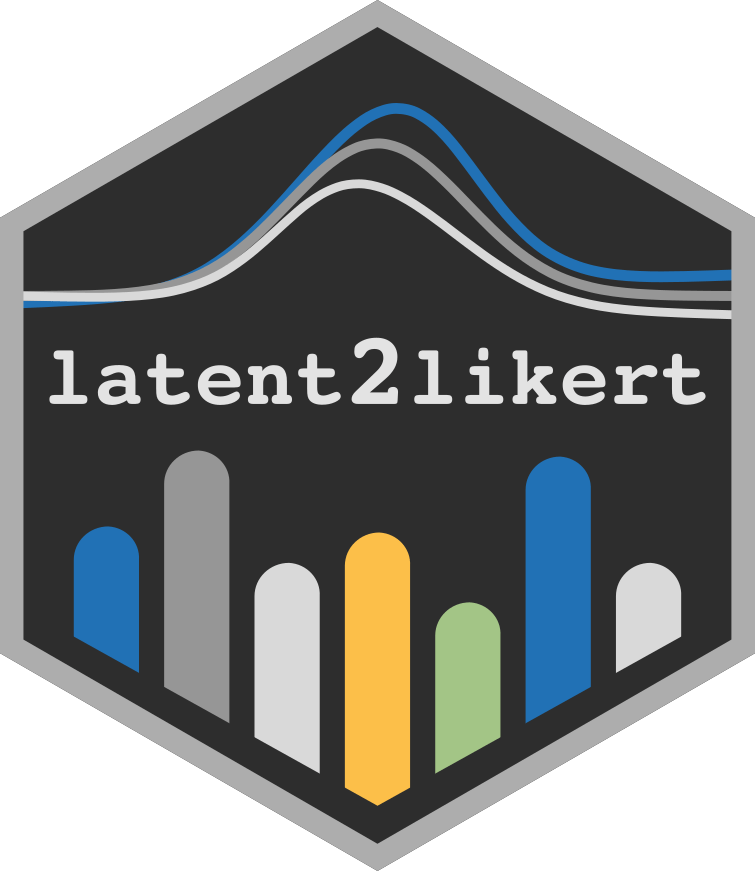

## latent2likert 

<!-- badges: start -->

[](https://github.com/markolalovic/latent2likert/actions/workflows/R-CMD-check.yaml)
[](https://codecov.io/gh/markolalovic/latent2likert)
[]()
<!-- badges: end -->

This package is designed to effectively simulate the discretization
process inherent to Likert scales while avoiding excessive distortion.
It converts continuous latent variables into ordinal categories to
generate Likert scale item responses. It is particularly useful for
accurately modeling and analyzing survey data that use Likert scales,
especially when applying statistical techniques that require metric
data.

## Installation

The development version can be installed using devtools:

``` r
# install.packages("devtools")
#TODO: load the new package
#devtools::install_github("markolalovic/latent2likert")
```

## Features

- **rLikert**: Generates random responses to Likert scale questions
  based on the specified means and standard deviations of latent
  variables, with optional settings for skewness and correlations.
- **estimate_parameters**: Estimates latent parameters from existing
  survey data.

## Dependency statement

To keep the package lightweight, latent2likert only imports
[mvtnorm](https://cran.r-project.org/package=mvtnorm), along with the
standard R packages stats and graphics, which are typically included in
R releases. An additional suggested dependency is the [sn
package](https://cran.r-project.org/package=sn), required only for
generating random responses from correlated Likert items based on a
multivariate skew normal distribution. The package prompts the user to
install this dependency during interactive sessions if needed.

## Further reading

- [Get
  started](https://lalovic.io/latent2likert/articles/latent2likert.html)
- [Functions
  reference](https://lalovic.io/latent2likert/reference/index.html)

## Contributions

Feel free to create issues for bugs or suggestions on the [issues
page](https://github.com/markolalovic/latent2likert/issues). You can
also make changes and submit a pull request. Contributions may include
bug fixes, new features or documentation improvements.
