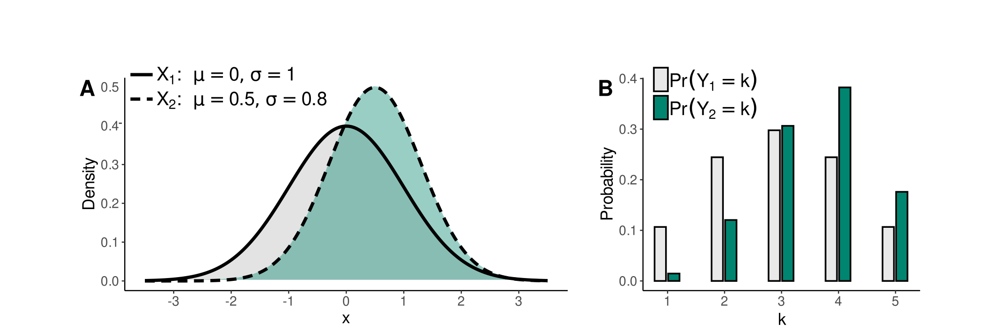

```{r setup, include=FALSE}
knitr::opts_chunk$set(
  echo = FALSE,
  collapse = TRUE,
  comment = "#>",
  dpi=450)
```

<!-- avoid border around the images -->
<style>
    img {
        border: 0;
    }
</style>

## Summary

The responsesR package helps users to create synthetic datasets resembling survey data frequently analyzed in applied social research, particularly ordered categorical items, also known as Likert items. Likert items represent responses to survey questions or ratings, typically arranged on a psychometric scale defined by verbal labels with roughly equidistant categories symmetrically centered around a neutral midpoint. The most common form has five categories: Strongly disagree, Disagree, Neutral, Agree, and Strongly agree.

This package simplifies the process of converting continuous random variables into simulated Likert items. Users can leverage continuous variables with known means and covariance structure, which undergo discretization into discrete variables. These discrete variables mirror the original continuous variables using Lloyd's algorithm, a technique commonly employed in signal processing and closely related to k-means clustering. Additionally, asymmetry can be introduced by incorporating skew normal distribution. Moreover, the package enables the reconstruction of latent parameters from discrete probability distributions, thereby allowing users to replicate existing survey data more accurately.

## Purpose

In social sciences, variables of interest are often conceptualized as hidden continuous variables, known as latent variables. These latent variables are not observed directly but are instead measured through Likert scale questions. This process is illustrated in Figure 1.

```{r survey_process_r, fig.align = 'center', out.width = "70%", fig.cap = "Figure 1: Flow diagram of the survey process.", echo = FALSE}

```

Researchers frequently aim to uncover the connections between these latent variables using diverse statistical techniques. For comparative analysis through simulation, having access to an effective algorithm to generate Likert items from hypothetical latent variables is essential. Furthermore, statistical techniques like Factor Analysis and Structural Equation Models assume metric data. However, survey data in the form of Likert items is ordinal, violating this assumption. Nevertheless, the use of these statistical techniques for probing such survey data is widespread. Realistic simulation of Likert items provides a way to assess the potential for inaccurate, biased, or misleading results when utilizing these techniques.

Simulating Likert item responses often begins by selecting a continuous distribution, which is then transformed into a discrete probability distribution using a method called discretization. This process is illustrated in Figure 2.

```{r simulation_process_r, fig.align = 'center', out.width = "70%", fig.cap = "Figure 2: Flow diagram of the simulation process.", echo = FALSE}
knitr::include_graphics("../../man/figures/simulation_process.png")
```

Typically, an unsupervised discretization approach is employed [@wu2017], where the continuous range is subdivided into smaller intervals. Adjusting these intervals allows for simulating responses with different distributions. While this unsupervised approach is popular for its simplicity, it may yield less than optimal results, particularly if the continuous distribution is non-uniform [@catlett1991]. Furthermore, in many simulation studies, e.g.: [@velicer2000], [@cho2009], the latent distribution is often assumed to follow a normal distribution. However, this assumption is primarily for statistical convenience. 

The purpose of the responsesR package is to address some of these issues by improving the simulation process. It achieves this by implementing a supervised discretization approach, using Lloyd's algorithm to ensure unbiased results and minimize distortion. This results in simulated Likert items with discrete probability distributions closely resembling the chosen continuous distributions. Additionally, this enables the reconstruction of the latent distribution from the given discrete probability distribution, or the estimation of latent parameters from actual survey data. Furthermore, the package can handle non-normal latent distributions and generate responses following skewed distributions. This functionality allows researchers to replicate survey data or simulate diverse survey data by adjusting parameters such as mean and standard deviation according to specific needs.

In summary, the purpose of this package is to provide an easy way to:

* Generate simulated survey responses with various distributions.
* Create synthetic survey data, particularly Likert items, by setting means, standard deviations, and correlations among latent variables.
* Recreate existing rating-scale data by estimating latent variable means and standard deviations.

## Dependency statement
To maintain a lightweight package, responsesR only imports [@genz2020], along with the standard R packages stats and graphics, which are typically included in R releases. An additional suggested dependency is the package sn [@azzalini2023], necessary only for generating random responses from correlated Likert items with multivariate skew normal latent distribution. However, the package prompts the user to install this dependency during interactive sessions.

## Related software
There are alternative approaches for simulating Likert item responses. One approach is to define a discrete probability distribution and sample from it. This can be done using the `sample` function in R or the `likert` function from package wakefield [@rinker2018]. Another approach involves specifying the means, standard deviations, and correlations among the Likert items, using packages such as LikertMakeR [@winzar2022] or SimCorMultRes [@touloumis2016] to generate correlated multinomial responses. Alternatively, one can define a data generating process. For example [@arnulf2018] is based on the semantic theory of survey responses. For those acquainted with item response theory, the mirt package [@chalmers2012] enables users to input discrimination and difficulty parameters for choosing each response category.

## Description
To describe the relationship between latent variables and Likert items consider the following model, detailed in [@boari2015]. Let $X$ denote the continuous variable of interest, measured using Likert scale question with $K$ response categories. The observed discrete variable $Y$, representing possible responses, is defined as follows
$$
Y = k, \quad \text{ if } \ \ \tau_{k - 1} < X \leq \tau_{k}
\quad \text{ for } \ \ k = 1, \dots, K.
$$
Here $\tau_{k}$, $k = 0, \dots, K$, are thresholds defined in the domain of $X$ such that
$$
-\infty = \tau_{0} < \tau_{1} < \dots < \tau_{K - 1} < \tau_{K} = \infty.
$$
The thresholds dictate the transformation of density $f_{X}$ of $X$ into a discrete probability distribution
\begin{equation*}
\text{Pr}(Y = k) = \int_{\tau_{k - 1}}^{\tau_{k}} f_{X}(x) \, dx
\quad \text{ for } \ \ k = 1, \dots, K.
\label{eq: probability_distribution}
\end{equation*}

To derive the thresholds, let $X_{1}$ be a random variable with mean 0 and standard deviation 1, representing the opinion or agreement of a neutral population which is measured using Likert scale question with $K$ response categories. To transform $X_{1}$ into a discrete random variable $Y_{1}$ with as little distortion as possible, define the distortion as mean-squared error
$$
\text{MSE} = \sum_{k = 1}^{K} \int_{\tau_{k - 1}}^{\tau_{k}}
f_{X_{1}}(x) \left( x - r_{k} \right)^{2} \, dx.
$$
Here, $r_{k}$, $k = 1, \dots, K$, are representatives of intervals $(\tau_{k - 1}, \tau_{k}), k = 0, \dots, K$ that divide the domain of $X_{1}$. Quantization, achieved through Lloyd's algorithm, finds optimal thresholds $\tau_{k}$ minimizing the mean-squared error (MSE). Although optimal representatives $r_{k}$ are found, they are not used since $Y_{1}$ takes values from $1$ to $K$. There are some disadvantages to measuring distortion only in a mean-squared sense. For example, we could make use of the fact that humans are more sensitive to some kinds of error than other, and for example permit larger errors when $|x|$ is large than when it is small.

Next, let $X_{2}$ be a random variable following the same distribution as $X_{1}$ but with different mean $\mu$ and standard deviation $\sigma$, representing the opinion or agreement of another population. The same thresholds $\tau_{k}$ are employed to compute the discrete probability distribution of random variable $Y_{2}$. Since $X_{1}$ and $X_{2}$ are measured using the same Likert scale question with $K$ response categories. In other words, the same categories $1, \dots, K$ are available to this second population.

This simulation process is visually depicted in Figures 3 and 4. These figures show the densities of normally distributed $X_{1}$ and $X_{2}$ in Figure 3A and skew normally distributed $X_{1}$ and $X_{2}$ with skewness $\gamma_{1} = - 0.6$ in Figure 4A. Corresponding discrete probability distributions of $Y_{1}$ and $Y_{2}$ with $K=5$ categories are presented in Figures 3B and 4B. 

```{r mapping_normal_r, fig.align = 'center', out.width = "90%", fig.cap = "Figure 3: Relationship between normally distributed $X$", echo = FALSE}

```

```{r mapping_skew_r, fig.align = 'center', out.width = "90%", fig.cap = "Figure 4: Relationship between skew normal $X$ with $\\gamma_{1} = -0.6$, and responses $Y$.", echo = FALSE}
knitr::include_graphics("../../man/figures/mapping_skew.png")
```

The relationship between continuous variable $X$ and discrete probability distribution $p_k$ can also be described by a system of non-linear equations
$$
p_{k} = F_{X}\left( \frac{\tau_{k - 1} - \xi}{\omega} \right)
- F_{X}\left( \frac{\tau_{k} - \xi}{\omega} \right)
\quad \text{ for } \ \ k = 1, \dots, K.
$$
where $F_{X}$ denotes the cumulative distribution function of continuous variable $X$. Solving these equations using an iterative scheme like the Newton method yields location and scaling parameters $\xi$ and $\omega$, allowing the reversal of the transformation. Consequently, knowing the discrete probability distribution $p_{k}$, we can reconstruct the parameters of the continuous distribution. Additionally, by utilizing estimates $\hat{p}_{k}$ instead of discrete probability distribution $p_{k}$, we can estimate the means and standard deviations of corresponding continuous random variables from responses to Likert-type questions.

To generate random responses from correlated Likert items, we first select the location vector, marginal skewness, and correlations between the latent variables. Then, draw a random sample from the multivariate normal or skew normal distribution with the appropriate location vector and covariance matrix. Lastly, discretize the sample using optimal thresholds $\tau_{k}$. Figure 5 illustrates this process for the case of 2 Likert items with 5 response categories, normal latent variables with means 0 and standard deviations 1, and a correlation of 0.7 between the variables.

```{r multivatiate_case_r, fig.align = 'center', out.width = "50%", fig.cap = "Figure 5: Normal bivariate and marginal latent distributions with a correlation of $0.7$ and optimal thresholds $\\tau_1, \\dots, \\tau_{4}$.", echo = FALSE}

```

## References
