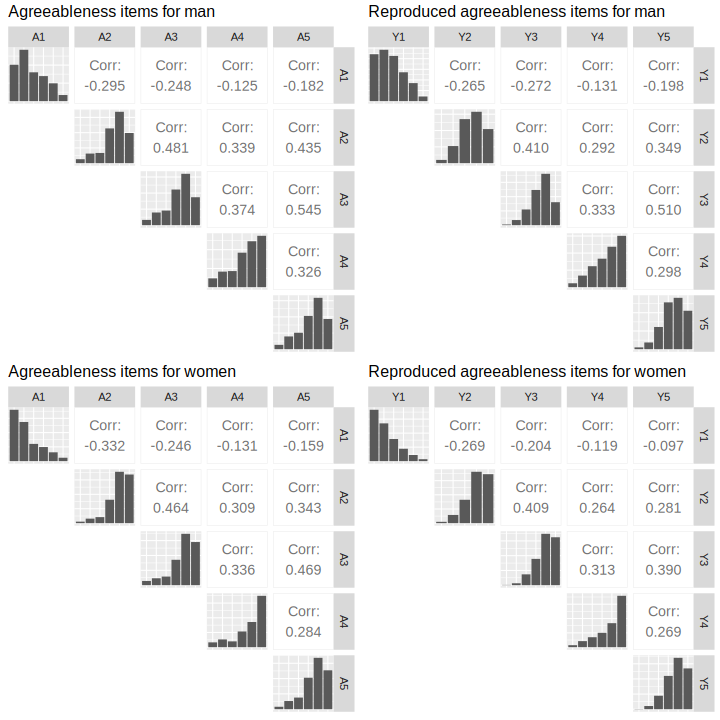
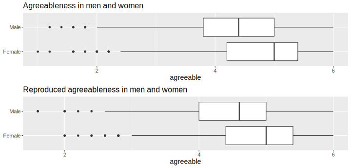

```{r setup, include=FALSE}
knitr::opts_chunk$set(
  echo = TRUE,
  collapse = TRUE,
  comment = "#>",
  fig.path = "../man/figures/articles/",
  dev = "svg")
```
```{r}
library(responsesR) # load responsesR
library(psych) # for the bfi data set

# optionally, to recreate the plots:
library("GGally")
library(gridExtra)
library(cowplot)
```


This article covers the topic of replicating survey data in order to create scale scores.

## Survey data
We will use [bfi dataset](https://search.r-project.org/CRAN/refmans/psych/html/bfi.html) from package 'psych' [@psych]. It is made up of 25 personality items, and some demographic attributes such as gender and education for 2800 subjects:

```{r}
library(psych)
str(bfi)
```

The personality items are split into 5 categories: agreeableness A1-5, conscientiousness C1-5, extraversion E1-5, neuroticism N1-5 and openness O1-5. Each item was answered on a six point scale ranging from 1 (very inaccurate), to 6 (very accurate).

Let's focus only on the first 5 items corresponding to agreeableness. To investigate the differences in agreeableness between men and women we will also use the gender attribute.
```{r}
vars <- c("A1", "A2", "A3", "A4", "A5")
data <- bfi[, c(vars, "gender")]
mapdf <- data.frame(old = 1:2, new = c("Male", "Female")) # Males = 1, Females =2
data$gender <- mapdf$new[match(data$gender, mapdf$old)]
head(data)
```

Examine the data for missing values:
```{r}
apply(data, 2, function(x) sum(is.na(x))/length(x))
```

Impute the missing values.
```{r}
for (var in vars) {
  data[, var][is.na(data[, var])] <- median(data[, var], na.rm=TRUE)
}
```

Save the new data set as a csv file.
```{r}
write.csv(data, "../../data/bfi_agreeableness_and_gender.csv", row.names=FALSE)
```

## Reproducing item responses
Check the size of the male and female samples.
```{r}
table(data$gender)
```

Separate the items into two groups according to their gender.
```{r}
items_M <- data[data$gender == "Male", vars]
items_F <- data[data$gender == "Female", vars]
```

To reproduce the items, start by estimating the parameters of the latent variables, assuming they are normal and providing the number of possible response categories 'K = 6':
```{r}
params_M <- estimate_parameters(data = items_M, K = 6)
params_F <- estimate_parameters(data = items_F, K = 6)
params_M
params_F
```

Then, generate new responses to the items using the estimated parameters and correlations:
```{r}
set.seed(12345) # to ensure reproducible results

new_items_M <- get_responses(n = nrow(items_M), 
                             mu = params_M["mu", ], 
                             sd = params_M["sd", ],
                             K = 6,
                             R = cor(items_M))

new_items_F <- get_responses(n = nrow(items_F), 
                             mu = params_F["mu", ],
                             sd = params_F["sd", ],
                             K = 6,
                             R = cor(items_F))
```

Let's compare the results, by plotting the correlations matrix with bar charts on the diagonal:
```{r}
corr_plot <- function(df, title="") {
  pairs <- ggpairs(df, 
                   upper = list(continuous = wrap(ggally_cor, stars=F, size=5)),
                   diag = "blank", lower = "blank")
  
  dff <- data.frame(df)
  for(j in 1:ncol(df)) {
    dff[, j] <- as.factor(df[, j])
  }
  pairsf <- ggpairs(dff, upper="blank", lower="blank", title=title) + 
    theme(axis.line=element_blank(),
          text = element_text(size = 14),
          plot.title = element_text(size = 16),
          axis.text=element_blank(), 
          axis.ticks=element_blank())
  for(i in 1:ncol(df)) {
    for(j in 1:ncol(df)) {
      if (j > i) {
        pairsf[i, j] <- pairs[i, j]
      }
    }
  }
  return(pairsf)
}
```

```{r}
p1 <- corr_plot(items_M, "Agreeableness items for man")
p2 <- corr_plot(new_items_M, "Reproduced agreeableness items for man")

p3 <- corr_plot(items_F, "Agreeableness items for women")
p4 <- corr_plot(new_items_F, "Reproduced agreeableness items for women")
p <- plot_grid(ggmatrix_gtable(p1), ggmatrix_gtable(p2), ggmatrix_gtable(p3), ggmatrix_gtable(p4),  ncol = 2)
ggsave(file="./man/figures/articles/agree_items_correlations_comparison.svg", plot=p, width=10, height=10)
```
```{r agree_items_correlations_comparison, fig.height=10, out.width = "100%", echo = FALSE, fig.alt="Agreeableness items correlations comparison"}

```

## Recreating scale scores
The next step would be to create agreeableness scale scores for both groups of participants, by taking the average of these 5 items.
```{r}
# Combine new items and gender in new_data data frame
new_data <- data.frame(rbind(new_items_M, new_items_F))
new_data$gender <- c(rep("Male", nrow(items_M)), rep("Female", nrow(items_F)))
head(new_data)

# We also need to reverse the first item because it has negative correlations
data$A1 <- (min(data$A1) + max(data$A1)) - data$A1
new_data$Y1 <- (min(new_data$Y1) + max(new_data$Y1)) - new_data$Y1

# Create agreeableness scale scores
data$agreeable <- rowMeans(data[, vars])
new_data$agreeable <- rowMeans(new_data[, c("Y1", "Y2", "Y3", "Y4", "Y5")])
```

And visualize the results with a grouped boxplot:
```{r}
scale_boxplot <- function(data, title="") {
  xbreaks <- seq(from = 2, to = 6, length.out = 3)
  p <- ggplot(data, aes(x = agreeable, y = gender)) + 
    geom_boxplot() +
    scale_x_continuous(breaks = xbreaks) +
    ggtitle(title) +
    theme(text = element_text(size = 14),
          plot.title = element_text(size = 16),          
          axis.title.y = element_blank())
  return(p)
}
```

```{r}
p1 <- scale_boxplot(data, "Agreeableness in men and women")
p2 <- scale_boxplot(new_data, "Reproduced agreeableness in men and women")
p <- plot_grid(p1, p2,  nrow = 2)
ggsave(file="./man/figures/articles/agreeableness_grouped_boxplot.svg", plot=p, width=10, height=4.8)
```

```{r agreeableness_grouped_boxplot, fig.height=4.8, out.width = "100%", echo = FALSE, fig.alt="Agreeableness items grouped boxplot"}

```

Finally, let's also run Welch's t-test to test if men and women differ on agreeableness using both data sets:
```{r}
t.test(agreeable ~ gender, data = data)
t.test(agreeable ~ gender, data = new_data)
```

## References

