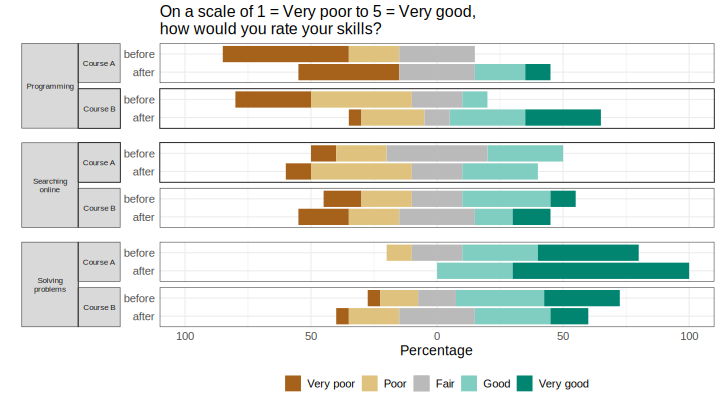

```{r setup, include=FALSE}
knitr::opts_chunk$set(
  echo = TRUE,
  collapse = TRUE,
  comment = "#>",
  fig.path = "./man/figures/articles/",
  dev = "svg")
```
```{r}
# load responsesR
library(responsesR)

# optionally, to recreate the plots:
library(RColorBrewer)
library(ggh4x)
```
This article covers the topic of simulating hypothetical survey data. The hypothetical survey simulation is roughly based on the actual comparative study on teaching and learning R in a pair of introductory statistics labs [@mcnamara2024teaching].

##  Comparison of introductory statistics courses
Imagine a situation in which 10 participants from Course A and 20 participants from Course B have completed the survey. Suppose that the initial question was:

> "How would you rate your experience with the course?" 

with four possible answers: 

> Poor, Fair, Good, and Excellent. 

Let's assume that the participants in Course A were neutral regarding the question and participants in Course B had a more positive experience on average.

By choosing appropriate parameters for the latent distributions and setting number of categories `K = 4`, we can generate hypothetical responses (standard deviation `sd = 1` and skewness `gamma1 = 0`, by default):
```{r}
set.seed(12345) # to ensure reproducible results
course_A <- get_responses(n = 10, mu = 0, K = 4)
course_B <- get_responses(n = 20, mu = 1, K = 4)
```

To summarize the results, create a data frame from all responses.
```{r}
K <- 4
ngroups <- 2
cats <- c("Poor", "Fair", "Good", "Excellent")
data <- data.frame(
  Course = rep(c("A", "B"), each=K),
  Response = factor(rep(cats, ngroups), levels=cats),
  Prop = c(get_prop_table(course_A, K), get_prop_table(course_B, K)))
data <- data[data$Prop > 0, ]
knitr::kable(data, format="html", row.names = FALSE)
```

The results can then be visualized using a grouped bar chart.
```{r}
xbreaks <- seq(from = 0, to = .8, length.out = 5)
xlimits <- c(0, max(data$Prop) + 0.01)
xlabs <- sapply(xbreaks, percentify)
data$Course <- factor(data$Course, levels = c("B", "A"))
p <- ggplot(data=data, aes(x=Prop, y=Response, fill=Course)) +
  geom_col(position=position_dodge2(preserve = "single", padding = 0)) +  
  scale_x_continuous(breaks = xbreaks, labels = xlabs, limits = xlimits) +  
  scale_y_discrete(limits = rev(levels(data$Response))) +
  scale_fill_manual("legend", 
                    values = c("#64BAAA", "#154E56"), 
                    labels = c("Course A", "Course B"),
                    limits = c("A", "B")) + 
  ggtitle("How would you rate your experience with the course?") +
  theme(text = element_text(size=14),
        axis.title.y = element_blank(),
        axis.title.x = element_blank(),
        legend.position = "right",
        legend.title = element_blank(),
        plot.title = element_text(size=16))

ggsave(file="./man/figures/articles/courses_grouped_bar_chart.svg", 
       plot=p, width=10, height=3.3)
```

```{r courses_grouped_bar_chart, fig.height=3.3, out.width = "80%", echo = FALSE, fig.alt="Courses grouped bar chart"}
knitr::include_graphics("./man/figures/articles/courses_grouped_bar_chart.svg")
```

## Pre and post comparison
Now suppose that the survey also asked the participants to rate their skills on a 5-point Likert scale, ranging from 1 (very poor) to 5 (very good) in:

* Programming, 
* Searching Online, 
* Solving Problems. 

The survey was completed by the participants both before and after taking the course for a pre and post-comparison. Suppose that participants' assessments of:

* Programming skills on average increased, 
* Searching Online stayed about the same,
* Solving Problems increased in Course A, but decreased for participants in Course B.

Let's simulate the survey data for this scenario (number of categories is `K = 5` by default):
```{r}
# Pre- and post assessments of skills: 1, 2, 3 for course A
pre_A <- get_responses(n = 10, mu = c(-1, 0, 1))
post_A <- get_responses(n = 10, mu = c(0, 0, 2))

# Pre- and post assessments of skills: 1, 2, 3 for course B
pre_B <- get_responses(n = 20, mu = c(-1, 0, 1))
post_B <- get_responses(n = 20, mu = c(0, 0, 0)) # <-- decrease for skill 3
```

Create a data frame from all responses to summarize the results:
```{r}
data <- list(pre_A, post_A, pre_B, post_B)
items <- 6 # for 3 questions before and after
K <- 5 # for a 5-point Likert scale
skills <- c("Programming", "Searching online", "Solving problems")
questions <- rep(as.vector(sapply(skills, function(skill) rep(skill, K))), 4)
questions <- factor(questions, levels = skills)
data <- data.frame (
  Course = c(rep("Course A", items * K), rep("Course B", items * K)),
  Question = questions,
  Time = as.factor(rep(c(rep("before", 3*K), rep("after", 3*K)), 2)),
  resp = rep(rep(seq_len(K), 3), length(data)),
  prop = as.vector(sapply(data, function(d) { 
    as.vector(t(get_prop_table(d, K))) })))
head(data)
```

And visualize the results with a stacked bar chart:
```{r}
data_pos <- data[data$resp >= 4, ]
data_neg <- data[data$resp <= 2, ]

data_neu <- data[data$resp == 3, ]
data_neu$prop <- data_neu$prop / 2

data_pos <- rbind(data_pos, data_neu)
data_pos$resp <- factor(data_pos$resp, levels = rev(1:5))

data_neg <- rbind(data_neg, data_neu)
data_neg$prop <- (-data_neg$prop)
data_neg$resp <- factor(data_neg$resp, levels = 1:5)

color_palette <- brewer.pal(n=5, name = "BrBG") 
color_palette[3] <- "#bababaff"
p <- ggplot(data = data_pos, aes(x = Time, y = prop, fill = resp)) +
  geom_col() +
  geom_col(data = data_neg) +
  coord_flip() +
  facet_nested(
    rows = vars(Question, Course), switch = "y",
    strip = strip_nested(size = "variable"),
    labeller = labeller(Question = label_wrap_gen(width = 10))
  ) +
  ggtitle("On a scale of 1 = Very poor to 5 = Very good, 
          how would you rate your skills?") +  
  theme_bw() +
  theme(strip.placement = "outside") +
  theme(
    axis.ticks.x = element_blank(),
    axis.ticks.y = element_blank(),
    legend.position = "bottom",
    legend.title = element_blank(),
    text = element_text(size = 14),
    strip.text.y.left = element_text(angle = 0, size = 8),
    panel.spacing.y = unit(c(2, 5, 2, 5, 2), "mm"),
    plot.title = element_text(size=16)
  ) +
  xlab("") +
  ylab("Percentage") +
  scale_y_continuous(limits = c(-1, 1), 
                     breaks = seq(from = -1, to = 1, by = 0.5), 
                     labels = c(100, 50, 0, 50, 100)) + 
  scale_fill_manual("", breaks = 1:5, values = color_palette,
                      labels = c("Very poor", "Poor", 
                                 "Fair", "Good", "Very good"))

ggsave(file="./man/figures/articles/courses_stacked_bar_chart.svg", 
       plot=p, width=10, height=5.6)
```

```{r courses_stacked_bar_chart, fig.height=5.6, out.width = "80%", echo = FALSE, fig.alt="Courses stacked bar chart"}

```


## References

